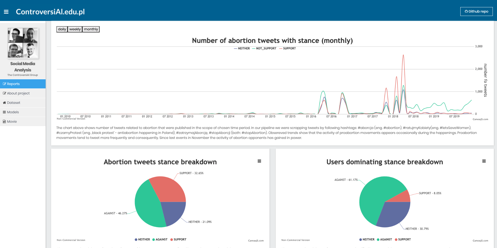

# Controversial.edu.pl

Project on stance detection of socially controversial topics on Twitter using NLP and ML techniques.
- ensemble of classifiers for stance detection
- visualization of change in support and key players network on social media

Front application of the project implemented in Agular 8.  

## Screen

